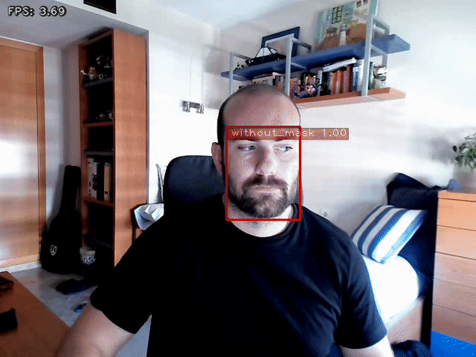

# TensorRT YOLOv4 mask detector model on a Jetson Nano
This project presents a mask detector using TensorRT YOLOv4 on a Jetson Nano Developer Kit B01 4GB. The dataset used for YOLOv4 training is the [Mask Dataset](https://makeml.app/datasets/mask) from [MakeML](https://makeml.app/). Cause the dataset is in `Pascal VOC` format, I have used the [xml2yolo](https://github.com/bjornstenger/xml2yolo) repository to convert the labels to [Darknet](https://github.com/AlexeyAB/darknet) format. YOLOv4 has been trained using a Google Colab Notebook based on the [YOLOv4-Cloud-Tutorial](https://github.com/theAIGuysCode/YOLOv4-Cloud-Tutorial) repository. The conversion of the Darknet model from YOLOv4 to TensorRT has been carried out with the [tensorrt_demos](https://github.com/jkjung-avt/tensorrt_demos) repository. The following sections explain in detail the steps to be followed to use the mask detector.

<p align="center">
    
</p>

## Hardware

- [Jetson Nano Developer Kit B01 4GB](https://www.amazon.es/gp/product/B07QWLMR24/ref=ppx_yo_dt_b_asin_title_o03_s01?ie=UTF8&psc=1) ([JetPack 4.4](https://developer.nvidia.com/jetpack-sdk-44-archive))
- [AUKEY Webcam 1080P Full HD](https://www.amazon.es/AUKEY-Linterna-Port%C3%A1til-Ultravioleta-Incorporadas/dp/B01KJZV59K)

## 1. Create a project folder

Run the following command to make sure you are in your home directory:

```bash
cd ~/
```

Create a folder called `project`:

```bash
mkdir project
cd project
```

## 2. Download the mask dataset

To train the model I used the dataset [Mask Dataset](https://makeml.app/datasets/mask) from [MakeML](https://makeml.app/). To download it run the following command:

```bash
wget https://arcraftimages.s3-accelerate.amazonaws.com/Datasets/Mask/MaskPascalVOC.zip
```

Create a folder called dataset to store all images and label files:

```bash
mkdir dataset
#Install the zip and unzip libraries if you don't have them
sudo apt install zip unzip
unzip MaskPascalVOC -d dataset/
rm MaskPascalVOC.zip
```

Inside the dataset folder there are two folders. One with the annotations and the other with the raw images.

```lisp
├── annotations
│   ├── maksssksksss0.xml
│   ├── maksssksksss1.xml
│   ├── maksssksksss2.xml
│   ├── maksssksksss3.xml
│   └── ...
└── images
    ├── maksssksksss0.png
    ├── maksssksksss1.png
    ├── maksssksksss2.png
    ├── maksssksksss3.png
    └── ...
```

## 3. Convert training image labels to YOLO format

Clone the following repository:

```bash
cd ~/project
git clone https://github.com/jmudy/xml2yolo.git
cd xml2yolo
```

Copy the label files to this directory and run the script `convert.py` to convert the labels from `Pascal VOC` format to `Darknet` format.

```bash
cp ../dataset/annotations/*.xml .
python3 convert.py
mv *.txt ../dataset/annotations/
rm ../dataset/annotations/*.xml
```

## 4. Train YOLOv4 on the custom dataset

The images for training and test have been divided in a ratio of 80-20% respectively.

Clone the following repository to download the files to be used in the training with Google Colab.

```bash
cd ~/project
git clone https://github.com/jmudy/mask-detector
cp -r mask-detector/yolov4-mask/ .
rm -r -f mask-detector/
```

Create `obj` and `test` folders to store the training and test images and labels, with a ratio of 80% training - 20% test.

```bash
cd ~/project/dataset
mkdir obj
mkdir test

cd images
cp $(ls -v | head -n 682) ../obj
cp $(ls -v | tail -n 171) ../test

cd ../annotations
cp $(ls -v | head -n 682) ../obj
cp $(ls -v | tail -n 171) ../test

cd ../
```

Shape of the `dataset` folder:

```lisp
├── images
├── annotations
├── obj
│   ├── maksssksksss0.png
│   ├── maksssksksss0.txt
│   ├── maksssksksss1.png
│   ├── maksssksksss1.txt
│   ├── maksssksksss2.png
│   ├── maksssksksss2.txt
│   └── ...
└── test
    ├── maksssksksss682.png
    ├── maksssksksss682.txt
    ├── maksssksksss683.png
    ├── maksssksksss683.txt
    ├── maksssksksss684.png
    ├── maksssksksss684.txt
    └── ...
```

Compress `obj` and `test` folders and save in `yolov4-mask` folder.

```bash
zip -r ../yolov4-mask/obj.zip obj/
zip -r ../yolov4-mask/test.zip test/
```

The following Google Colab Notebook can be used to train the model with the custom dataset (NOTE: Copy the `yolov4-mask` folder to the root of your Google Drive folder before using the Notebook)

https://colab.research.google.com/drive/1MriQiq8z7lxsDWkibTULqymypdeas_d-?usp=sharing

At the end of training rename the file `/mydrive/yolov4-mask/backup/yolov4-mask_best.weights` to `yolov4-mask.weights`.

## 5. Convert YOLOv4 to TensorRT model

Clone the following repository:

```bash
cd ~/project
git clone https://github.com/jkjung-avt/tensorrt_demos.git
cd tensorrt_demos
```

Build and install the following dependencies:

```bash
cd ssd
bash install_pycuda.sh
cd ../
wget https://raw.githubusercontent.com/jkjung-avt/jetson_nano/master/install_protobuf-3.8.0.sh
bash install_protobuf-3.8.0.sh
sudo pip3 install onnx==1.4.1
```

Compile with make:

```bash
cd plugins
make
```

Copy in the `~/project/tensorrt_demos/yolo/` folder the `yolov4-mask.cfg` file you have used and the `yolov4-mask.weights` file that has been created in the training with Google Colab and convert the Darknet model to ONNX model and then to TensorRT engine.

```bash
cd ~/project/tensorrt_demos/yolo
python3 yolo_to_onnx.py -m yolov4-mask
python3 onnx_to_tensorrt.py -m yolov4-mask
```

Change the `COCO_CLASSES_LIST` in the `yolo_classes.py` file located in the `~/project/tensorrt_demos/utils/` folder with the classes that have been trained:

```bash
"""yolo_classes.py

NOTE: Number of YOLO COCO output classes differs from SSD COCO models.
"""

COCO_CLASSES_LIST = [
    'with_mask',
    'without_mask',
    'mask_weared_incorrect',
]

# For translating YOLO class ids (0~79) to SSD class ids (0~90)
yolo_cls_to_ssd = [
    1, 2, 3, 4, 5, 6, 7, 8, 9, 10, 11, 13, 14, 15, 16, 17, 18, 19, 20,
    21, 22, 23, 24, 25, 27, 28, 31, 32, 33, 34, 35, 36, 37, 38, 39, 40,
    41, 42, 43, 44, 46, 47, 48, 49, 50, 51, 52, 53, 54, 55, 56, 57, 58,
    59, 60, 61, 62, 63, 64, 65, 67, 70, 72, 73, 74, 75, 76, 77, 78, 79,
    80, 81, 82, 84, 85, 86, 87, 88, 89, 90,
]

def get_cls_dict(category_num):
    """Get the class ID to name translation dictionary."""
    if category_num == 3:
        return {i: n for i, n in enumerate(COCO_CLASSES_LIST)}
    else:
        return {i: 'CLS%d' % i for i in range(category_num)}
```
Change in the `trt_yolo.py` file the default value of the classes that are detected and increase the confidence threshold:

```bash
cd ~/project/tensorrt_demos
sed -i '33s/default=80/default=3/' trt_yolo.py
sed -i '101s/conf_th=0.3/conf_th=0.8/' trt_yolo.py
```
## 6. Results

Run the following command to display the results:

```bash
cd ~/project/tensorrt_demos
python3 trt_yolo.py --usb 0 --model yolov4-mask
```

To view the demo please click on the following YouTube link:

https://www.youtube.com/watch?v=YohIfmsn2Jg

## References  

   This project is totally inspired by the following previous repositories:

  * [xml2yolo](https://github.com/bjornstenger/xml2yolo)
  * [darknet](https://github.com/AlexeyAB/darknet)
  * [YOLOv4-Cloud-Tutorial](https://github.com/theAIGuysCode/YOLOv4-Cloud-Tutorial)
  * [tensorrt_demos](https://github.com/jkjung-avt/tensorrt_demos)
